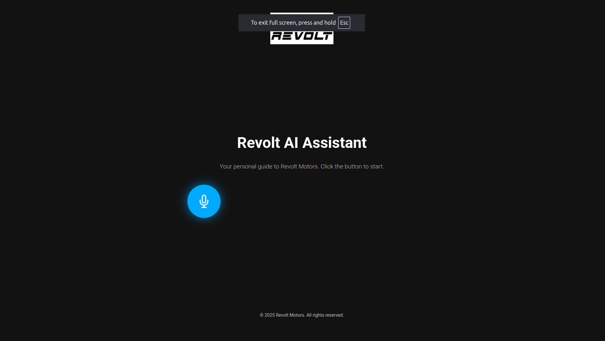

# Revolt Motors AI Voice Assistant

A real-time, conversational AI assistant that acts as a knowledgeable guide for Revolt Motors. This project showcases a low-latency, voice-first experience with natural interruption handling, built with Node.js and the Google Gemini Live API.



## ✨ Features

* **Real-Time Conversation**: Engage in smooth, natural back-and-forth dialogue with the AI.
* **Low-Latency Audio Streaming**: Optimized for minimal delay between speaking and receiving a response, using a WebSocket-based architecture.
* **Natural Interruption Handling**: The assistant immediately stops speaking and listens when the user begins to talk, creating a more fluid conversational flow.
* **Focused Knowledge Base**: The AI is configured with a system instruction to act as a specialist for Revolt Motors, ensuring on-topic and relevant responses.
* **Modern & Responsive UI**: A clean, professional landing page that works seamlessly across desktop and mobile devices.
* **Modular Backend Architecture**: The Node.js server is structured with separated concerns for easy maintenance and scalability.

## 🛠️ Tech Stack

* **Backend**: Node.js, Express.js
* **Real-Time Communication**: WebSockets (`ws` library)
* **AI Service**: Google Gemini Live API (`@google/genai`)
* **Frontend**: HTML5, CSS3, JavaScript (with Web Audio API)
* **Environment Management**: `dotenv`

## 📂 Project Structure

The backend is organized into a modular structure to separate concerns, making the codebase clean and maintainable.

```
revolt-ai-assistant/
├── src/
│   ├── api/
│   │   └── gemini/
│   │       ├── geminiService.js   # Handles all communication with the Gemini API
│   │       └── geminiConfig.js    # AI model and system instruction configuration
│   ├── config/
│   │   └── index.js               # Centralized configuration (ports, keys)
│   ├── utils/
│   │   └── network.js             # Network utility functions (e.g., DNS checks)
│   └── websocket/
│       └── handlers.js            # Core WebSocket connection and message handling logic
├── public/                        # All client-side files
│   ├── index.html
│   ├── style.css
│   ├── client.js
│   └── audio-processor.js         # AudioWorklet for efficient mic input
├── .env
├── package.json
└── server.js                      # Main server entry point
```

## 🚀 Setup and Installation

Follow these steps to get the project running on your local machine.

### Prerequisites

* Node.js (v18 or later recommended)
* npm (comes with Node.js)
* A Google Gemini API Key

### 1. Clone the Repository

```bash
git clone https://github.com/your-username/revolt-ai-assistant.git
cd revolt-ai-assistant
```

### 2. Install Dependencies

Install the required npm packages for the server.

```bash
npm install
```

### 3. Configure Environment Variables

Create a `.env` file in the root of the project and add your Google Gemini API key.

```env
# .env

GEMINI_API_KEY="YOUR_GEMINI_API_KEY_HERE"
PORT=3000
```

### 4. Start the Server

Run the following command to start the Node.js server.

```bash
node server.js
```

You should see the following output in your terminal, indicating the server is running:

```
🚀 Server is listening on port 3000
```

## 🎤 Usage

1.  Open your web browser and navigate to `http://localhost:3000`.
2.  Click the large microphone button to start the conversation.
3.  Your browser will ask for permission to use your microphone. Click **Allow**.
4.  Begin speaking. The assistant will respond in real-time.
5.  To interrupt the assistant while it's speaking, simply start talking at a normal volume.

## 📜 License

This project is licensed under the MIT License. See the `LICENSE` file for details.